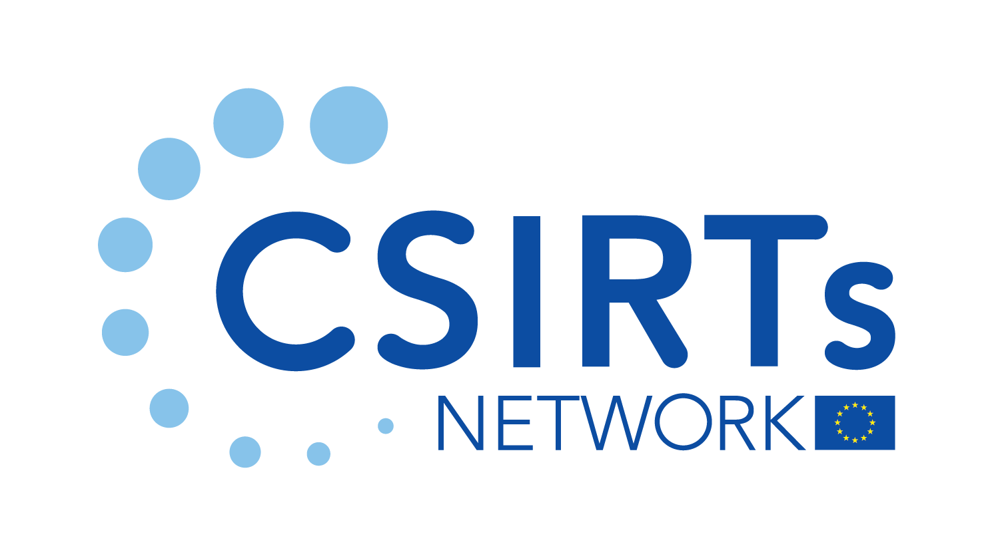

[The list of guidance publications by CSIRTs NW members and partners is currently under construction.]
                                                   
# CSIRTs Network - Security Guidance 
## Guidance publications
- [Heightened Threat Level Guidance](heightened.md)
- [Ransomware Guidance](ransomware.md)

## Advisories
- [MS Exchange On-Premise "ProxyNotShell" 0-days](advisories/CVE-2022-41040%20and%20CVE-2022-41082.md)
- [MSDT "Follina" Vulnerability](advisories/follina.md)
- [Log4j "Log4Shell" Vulnerability](advisories/log4j.md)

## Security best-practices
- [Business Continuity](#business-continuity)
   - [Backups](#backups)
   - [DDoS protection](#ddos-protection)
- [Authentication](#authentication)
- [Network Security / Architecture](#network-security--architecture)
- [Cloud Security](#cloud-security)
- [Monitoring / Logging](#monitoring--logging)
- [Email Security](#email-security)
- [Incident Response](#incident-response)
- [Industrial Control System Security](#industrial-control-system-security)
- [Webserver Security](#webserver-security)
- [Additional Best-Practices](#additional-best-practices)
- [Vulnerability Handling](#vulnerability-handling)
   - [Vulnerability Disclosure Policies](#vulnerability-disclosure-policies)
   - [Vulnerability Advisory Sources](#vulnerability-advisories)
   - [Vulnerability Scanning](#vulnerability-scanning)
- [Training Material](#trainings)

### Business Continuity

#### Backups
| Country | Organisation | Language | Material |
| :-----: | :----------: | :------: | :------ |
| EU | ENISA | EN | <a href="https://www.enisa.europa.eu/securesme/cyber-tips/strengthen-technical-measures/secure-backups">Guidance on Secure Backups (1 September 2021)</a> |
| LU | CIRCL | EN | <a href="https://www.circl.lu/pub/tr-55/">TR-55 - SquashFu - an alternate Open Source Backup solution, resilient to Crypto Ransomware attacks (12 September 2018)</a> |

#### DDoS protection
| Country | Organisation | Language | Material |
| :-----: | :----------: | :------: | :------ |
| AT | CERT-AT |  DE | <a href="https://cert.at/de/warnungen/2021/6/ddos-angriffe-gegen-unternehmen-in-osterreich">DDoS Angriffe gegen Unternehmen in Österreich </a> |
| BE | CERT-BE |  FR | <a href="https://cert.be/fr/paper/ddos-protection-et-prevention">DDOS: protection et prévention [PDF]</a> |
| DE | BSI |  DE | <a href="https://www.allianz-fuer-cybersicherheit.de/Webs/ACS/DE/Informationen-und-Empfehlungen/Empfehlungen-nach-Gefaehrdungen/DDoS/ddos_node.html">Praktische Informationen zur Vermeidung von DDoS-Anfällen und Hilfestellungen bei der Reaktion</a> |
| FI |	NCSC-FI | FI | <a href="https://www.kyberturvallisuuskeskus.fi/fi/julkaisut/neuvoja-palvelunestohyokkayksen-estamiseksi"> Neuvoja palvelunestohyökkäyksen estämiseksi [PDF] </a> |
| FR |	CERT-FR | FR | <a href="https://www.ssi.gouv.fr/administration/guide/comprendre-et-anticiper-les-attaques-ddos/">Comprendre et anticiper les attaques DDoS [PDF]</a> |
| HU | NCSC-HU | HU | <a href="https://nki.gov.hu/wp-content/uploads/2022/03/DOS_tamadasok_elleni_vedekezes-1.pdf">Védekezés a szolgáltatás megtagadásra irányuló DOS támadások ellen [PDF] (10 March 2022)</a> |
| LT | CERT-LT | LT | [APSAUGA NUO PASLAUGŲ TRIKDYMO KIBERNETINIŲ ATAKŲ [PDF] (5 November 2021)](https://www.nksc.lt/doc/biuleteniai/2021-11-05_DDoS.pdf) |
| LU | CIRCL | EN | <a href="https://www.circl.lu/pub/tr-19/">TR-19 - UDP Protocols Security - Recommendations To Avoid or Limit DDoS reflection / amplification (8 July 2015)</a> |
| PL |	KNF CSIRT | PL | <a href="https://www.knf.gov.pl/knf/pl/komponenty/img/Dobre praktyki w zakresie przeciwdziałania atakom DDoS_77247.pdf">Dobre praktyki w zakresieprzeciwdziałania atakom DDoS [PDF]</a> |
| PL |	KNF CSIRT | EN | <a href="https://www.knf.gov.pl/knf/pl/komponenty/img/Good_practice_against_DDoS_EN_78023.pdf">Good Practices in DDoS countermeasures [PDF]</a> |

### Authentication
| Country | Organisation | Language | Material |
| :-----: | :----------: | :------: | :------ |
| PL | CERT-PL | PL | <a href="https://cert.pl/hasla/">Hasła - Materiałów, kierowany do wielu grup odbiorców"</a> |

### Network Security / Architecture
| Country | Organisation | Language | Material |
| :-----: | :----------: | :------: | :------ |
| NL | NCSC-NL |  EN | <a href="https://english.ncsc.nl/publications/factsheets/2021/augustus/18/factsheet-prepare-for-zero-trust">Factsheet "Prepare for Zero Trust" (18 August 2021)</a> |

### Cloud Security
| Country | Organisation | Language | Material |
| :-----: | :----------: | :------: | :------ |
| NL | NCSC-NL |  EN | <a href="https://english.ncsc.nl/publications/factsheets/2020/december/31/factsheet-5-recommendations-for-securely-purchasing-cloud-services">Factscheet "5 recommendations for securely purchasing cloud services" (31 December 2020)</a> |

### Monitoring / Logging 
| Country | Organisation | Language | Material |
| :-----: | :----------: | :------: | :------ |
| EU | ENISA |  EN | <a href="https://www.enisa.europa.eu/publications/proactive-detection-measures-and-information-sources">Proactive detection – Measures and information sources (26 May 2020)</a> |

### Email Security
| Country | Organisation | Language | Material |
| :-----: | :----------: | :------: | :------ |
| EUI | CERT-EU |  EN | <a href="https://media.cert.europa.eu/static/WhitePapers/CERT-EU-SWP_14_005_v1_0.pdf">E-Mail Sender Adress Forgery Mitigation [PDF]</a> |
| EUI | CERT-EU |  EN | <a href="https://cert.europa.eu/static/WhitePapers/Updated-CERT-EU_Security_Whitepaper_DMARC_17-001_v1_2.pdf">DMARC — Defeating E-Mail Abuse [PDF]</a>|
| LU | CIRCL | EN | <a href="https://www.circl.lu/pub/tr-60/">TR-60 - Phishing - Effects and precautions (26 June 2020)</a> |
| PL | CERT-PL | PL | <a href="https://cert.pl/posts/2021/10/mechanizmy-weryfikacji-nadawcy-wiadomosci/">Mechanizmy weryfikacji nadawcy wiadomości</a> |

### Incident Response
| Country | Organisation | Language | Material |
| :-----: | :----------: | :------: | :------ |
| EU | ENISA | EN | <a href="https://www.enisa.europa.eu/publications/standards-and-tools-for-exchange-and-processing-of-actionable-information">Standards and tools for exchange and processing of actionable information (19 January 2015)</a> |

### Webserver Security 
| Country | Organisation | Language | Material |
| :-----: | :----------: | :------: | :------ |
| LU | CIRCL | EN | <a href="https://www.circl.lu/pub/tr-26/">TR-26 - Security Recommendations for Web Content Management Systems and Web Servers (28 April 2015)</a> |
| LU | CIRCL | EN | <a href="https://www.circl.lu/pub/tr-66/">TR-66 - Webservers with mod_status like debug modules publicly available leak information (6 December 2021)</a> |

### Industrial Control System Security 
| Country | Organisation | Language | Material |
| :-----: | :----------: | :------: | :------ |
| DE | BSI |  EN | <a href="https://www.bsi.bund.de/EN/Topics/Industry_CI/ICS/ics_node.html">Industrial Control System Security</a> |
| DE | BSI |  DE | <a href="https://www.bsi.bund.de/ICS">Industrielle Steuerungs- und Automatisierungssysteme (ICS)</a> |
| DE | BSI |  EN | <a href="https://www.allianz-fuer-cybersicherheit.de/SharedDocs/Downloads/Webs/ACS/DE/BSI-CS/BSI-CS_005E.html">Industrial Control System Security: Top 10 threats and countermeasures 2022</a> |  
| HU | NCSC-HU & SeConSys | HU | <a href="https://nki.gov.hu/wp-content/uploads/2022/04/SeConSys_online_kezikonyv_2022_FINAL_22-03-03.pdf">Villamosenergetikai ipari felügyeleti rendszerek kiberbiztonsági kézikönyve 2022 [PDF] (3 March 2022) </a> |

### Additional Best-Practices 
| Country | Organisation | Language | Material |
| :-----: | :----------: | :------: | :------ |
| EU | CERT-EU / ENISA | EN |<a href="https://www.enisa.europa.eu/publications/boosting-your-organisations-cyber-resilience">Boosting your Organisation's Cyber Resilience - Joint Publication (14 February 2022)</a>|
| EU | CERT-EU | EN |<a href="https://media.cert.europa.eu/static/WhitePapers/TLP-WHITE-CERT-EU_Security_Guidance-22-001_v1_0.pdf">Cybersecurity mitigation measures against critical threats [PDF] (09 March 2022)</a>|
| FI | NCSC-FI | EN | <a href="https://www.kyberturvallisuuskeskus.fi/en/ncsc-news/instructions-and-guides/keeping-your-information-secure-both-home-and-work">Keeping your information secure both at home and at work (12 May 2020)</a> |
| NL | NCSC-NL | EN | <a href="https://english.ncsc.nl/publications/publications/2021/august/4/guide-to-cyber-security-measures">Guide to Cyber Security Measures (05 August 2021)</a> |
| LU | CIRCL | EN | <a href="https://www.circl.lu/pub/tr-47/">TR-47 - Recommendations regarding Abuse handling for ISPs and registrars (23 February 2017)</a> |

## Vulnerability Handling
### Vulnerability Disclosure
| Country | Organisation | Language | Material |
| :-----: | :----------: | :------: | :------ |
| EU | ENISA |  EN | <a href="https://www.enisa.europa.eu/news/enisa-news/coordinated-vulnerability-disclosure-policies-in-the-eu">Coordinated Vulnerability Disclosure policies in the EU</a> |
| FI | NCSC-FI | EN | <a href="https://www.kyberturvallisuuskeskus.fi/en/our-services/situation-awareness-and-network-management">Vulnerability Coordination and Reporting</a> |
| NL | NCSC-NL | EN | <a href="https://english.ncsc.nl/publications/publications/2019/juni/01/coordinated-vulnerability-disclosure-the-guideline">Coordinated Vulnerability Disclosure: the Guideline (02 October 2018)</a> |
| SK | SK-CERT | EN | <a href="https://www.sk-cert.sk/en/vulnerability-reporting/index.html">Vulnerability Reporting Guideline (07 October 2019)</a> |
| LU | CIRCL | EN | <a href="https://circl.lu/pub/responsible-vulnerability-disclosure/">Responsible Vulnerability Disclosure (October 2019)</a> |
| LV | CERT-LV | EN | <a href="https://cert.lv/en/2016/09/cert-lv-responsible-disclosure-policy">Responsible Vulnerability Disclosure (September 2019)</a> |

### Vulnerability Advisories 
| Country | Organisation | Language | Material |
| :-----: | :----------: | :------: | :------ |
| EU | CERT-EU |  EN | <a href="https://cert.europa.eu/cert/newsletter/en/latest_SecurityBulletins_.html">CERT-EU Security Advisories</a> |
| FR | CERT-FR |  FR | <a href="https://www.cert.ssi.gouv.fr/avis/">Avis de sécurité</a> |
| DE | CERT-Bund |  DE | <a href="https://cert-bund.de/overview">CERT-Bund Warn- und Informationsdienste</a> |
| NL | NCSC-NL |  NL | <a href="https://advisories.ncsc.nl/advisories">Overzicht gepubliceerde Advisories</a> |

### Vulnerability Scanning 
| Country | Organisation | Language | Material |
| :-----: | :----------: | :------: | :------ |
| DE | BSI |  DE | <a href="https://www.allianz-fuer-cybersicherheit.de/SharedDocs/Downloads/Webs/ACS/DE/BSI-CS/BSI-CS_007.pdf?__blob=publicationFile&v=1">Schwachstellen-Analyse in Netzen unter Einsatz von OpenVAS [PDF]</a> |

## CNW Member Repositories
| Country | Organisation | Language | Material |
| :-----: | :----------: | :------: | :------ |
| AT | CERT-AT | EN | [CERT-AT Github](https://github.com/certat) |
| DE | BSI | EN | [BSI Github](https://github.com/bsi-bund) |
| DE | CERT-Bund | EN | [CERT-Bund Github](https://github.com/cert-bund) |
| EE | CERT-EE | EN | [CERT-EE Github](https://github.com/cert-ee) |
| ES | CCN-CERT | EN | [CCN-CERT Github](https://github.com/ccn-cert) |
| ES | INCIBE | EN | [INCIBE Github](https://github.com/INTECOCERT) |
| EU | CERT-EU | EN | [CERT-EU Github](https://github.com/certeu) |
| EU | CNW Tooling WG | EN | [CSIRT Tooling Github](https://github.com/csirt-tooling-org) |
| FR | ANSSI | EN | [ANSSI Github](https://github.com/anssi-fr) |
| LU | CIRCL | EN | [CIRCL Github](https://github.com/CIRCL) |
| LU | Govert.LU | EN | [Govcert.lu Github](https://github.com/GOVCERT-LU) |
| NL | NCSC-NL | EN | [NCSC-NL Github](https://github.com/NCSC-NL/) |
| PL | CERT-PL | EN | [CERT-PL Github](https://github.com/CERT-Polska/) |
| SK | SK-CERT | EN | [SK-CERT Github](https://github.com/SK-CERT/) |

## Trainings 
| Country | Organisation | Language | Material |
| :-----: | :----------: | :------: | :------ |
| EU | ENISA | EN | <a href="https://www.enisa.europa.eu/topics/trainings-for-cybersecurity-specialists/online-training-material">Online Trainings Resources (Technical, Operational, Setting up a CSIRT, Legal & Cooperation)</a> |
| LU | CIRCL | EN | <a href="https://www.circl.lu/services/misp-malware-information-sharing-platform/">MISP - Open Source Threat Intelligence Platform</a> |

 

For more information about CSIRTs Network Members and how to get in contact please visit https://csirtsnetwork.eu/ 
